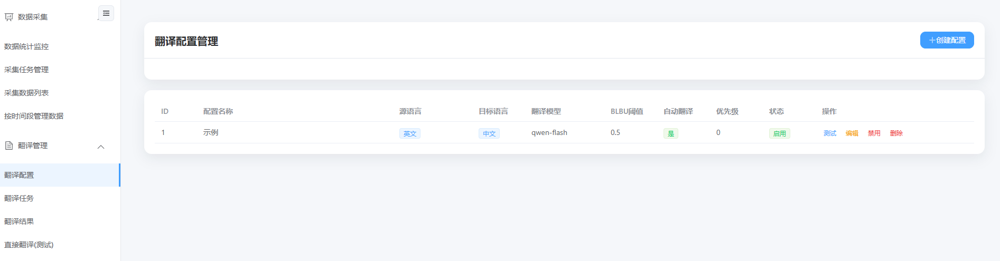
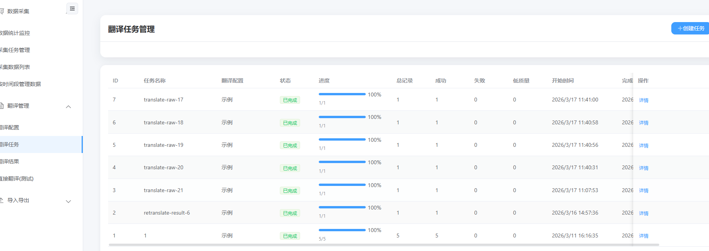
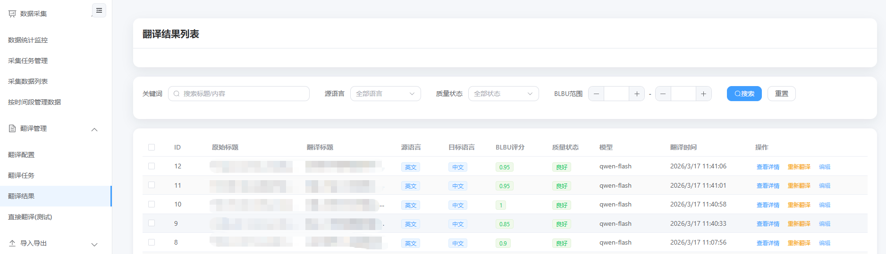
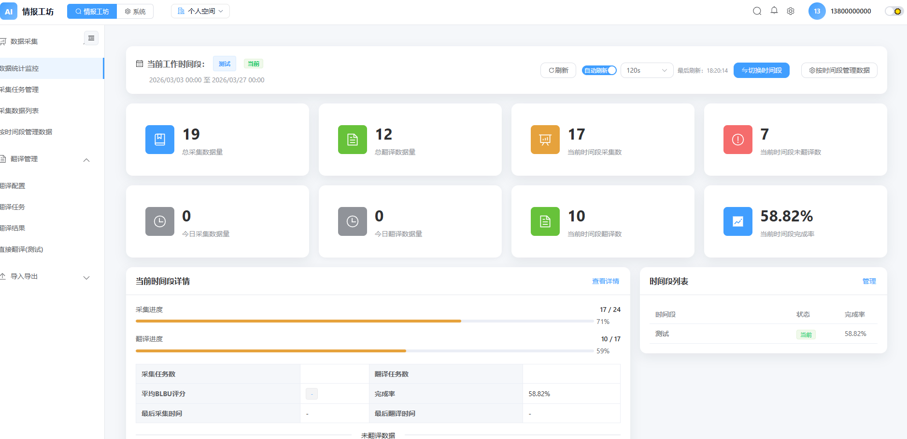
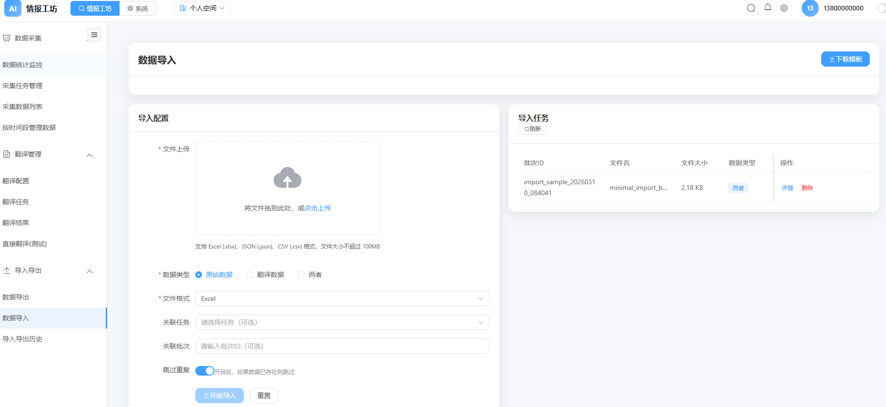
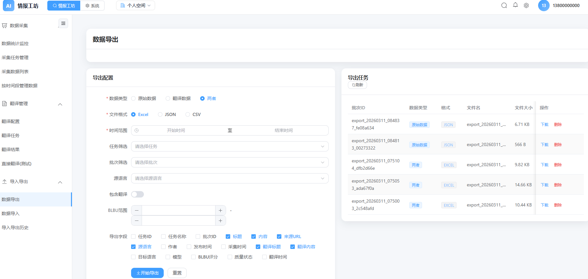
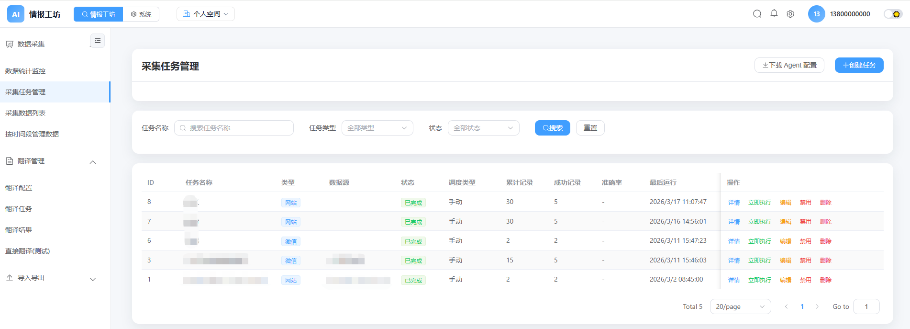
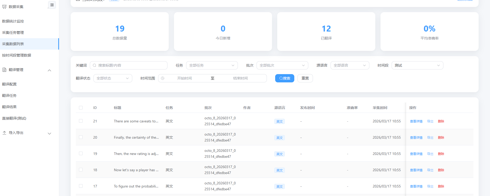
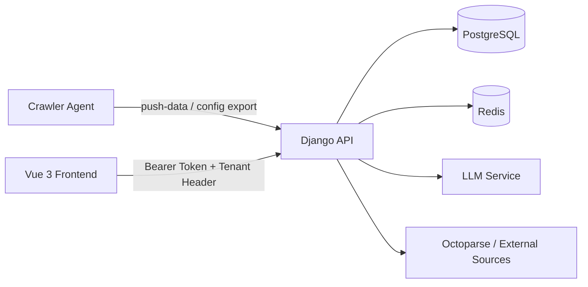

# 情报工坊 / Intelligence Workshop

一句话介绍：基于 Django、Vue 3 与独立爬虫 Agent 的多租户情报采集、翻译、导入导出一体化平台。

## 项目展示

### 翻译配置


### 翻译任务


### 翻译结果


### 翻译数据统计


### 翻译导入


### 翻译导出


### 翻译采集任务


### 翻译采集数据


## 目录

本文档对应的目录技术总结统一存放在 `src/` 下，按“目录名.md”组织。

| 文档 | 说明 |
| --- | --- |
| `src/apps.md` | Django 应用层总览 |
| `src/data_collection.md` | 数据采集、翻译、导入导出业务域 |
| `src/users.md` | 认证、租户、RBAC、系统配置 |
| `src/backend.md` | Django 项目入口与全局配置 |
| `src/frontend.md` | Vue 前端工程总览 |
| `src/src.md` | `frontend/src` 源码分层 |
| `src/components.md` | 复用组件与导航外壳 |
| `src/TiptapEditor.md` | 富文本编辑器扩展 |
| `src/composables.md` | 组合式状态逻辑 |
| `src/layouts.md` | 应用布局层 |
| `src/pages.md` | 页面入口集合 |
| `src/router.md` | 路由与登录守卫 |
| `src/shared.md` | API 封装与模块映射 |
| `src/styles.md` | 主题样式资源 |
| `src/types.md` | 前端类型补充 |
| `src/utils.md` | 文本与 HTML 差异处理 |
| `src/crawler_agent.md` | 独立采集 Agent 总览 |
| `src/parsers.md` | 采集解析器集合 |
| `src/storage.md` | Agent 本地存储层 |
| `src/docker.md` | Compose、Dockerfile 与启动脚本 |
| `src/docs.md` | 设计文档与接口文档资产 |
| `src/scripts.md` | 本地脚本与演示脚本 |
| `src/templates.md` | SPA 模板入口 |
| `src/test.md` | 端到端与联调脚本 |
| `src/tests.md` | Smoke test 与测试样本 |

## 架构图



## 配置

所有示例均已脱敏，密钥、手机号、域名与仓库地址均以占位符表示。

| 配置域 | 关键项 | 说明 |
| --- | --- | --- |
| Django | `DJANGO_SECRET_KEY`, `DEBUG`, `ALLOWED_HOSTS` | 控制安全与运行模式 |
| PostgreSQL | `DB_NAME`, `DB_USER`, `DB_PASSWORD`, `DB_HOST`, `DB_PORT` | 后端主数据存储 |
| Redis | `REDIS_HOST`, `REDIS_PORT`, `REDIS_PASSWORD`, `REDIS_DB` | 验证码、限流、缓存 |
| Auth | `AUTH_SECRET` | 自定义密码哈希与令牌逻辑依赖 |
| LLM | `LLM_API_BASE_URL`, `LLM_API_KEY`, `LLM_DEFAULT_MODEL` | 翻译与质量评估 |
| WeChat | `WECHAT_APPID`, `WECHAT_APPSECRET`, `WECHAT_REDIRECT_URI` | 微信登录接入 |
| Ports | `BACKEND_PORT`, `FRONTEND_PORT` | 本地或容器暴露端口 |
| Crawler Agent | `INGEST_API_KEY` | Agent 推送数据与拉取配置鉴权 |

推荐的脱敏 `.env` 基线：

```env
DJANGO_SECRET_KEY=<YOUR_SECRET_KEY>
DEBUG=True
DB_HOST=localhost
DB_PORT=5432
REDIS_HOST=localhost
REDIS_PORT=16379
LLM_API_KEY=<YOUR_LLM_API_KEY>
WECHAT_APPID=<YOUR_WECHAT_APPID>
WECHAT_APPSECRET=<YOUR_WECHAT_APPSECRET>
```

## 核心特色

- 采集、翻译、导入导出按业务域拆分，但共享统一租户隔离与权限体系。
- 支持外部 `crawler_agent` 拉取配置、自主采集、增量推送、失败重放。
- 前端通过模块化导航把“情报工坊”和“系统管理”拆成双工作台。
- 翻译链路内置 LLM 调用、BLBU 质量评估、低质量重试与任务进度跟踪。
- 导入导出支持批次化执行、模板下载、失败记录追溯与时间段关联。

## 工具概览

| 类别 | 工具/框架 | 用途 |
| --- | --- | --- |
| 后端 | Django, Django REST Framework | API、ORM、认证、后台基础设施 |
| 前端 | Vue 3, Vite, Pinia, Vue Router | 单页应用与模块化工作台 |
| UI | Element Plus, Tiptap, Quill, ECharts | 管理后台组件、编辑器、图表 |
| 数据层 | PostgreSQL, Redis, SQLite | 主库、缓存、Agent 本地落盘 |
| 部署 | Docker, Docker Compose, Nginx, Gunicorn | 开发/生产部署 |
| 爬取 | requests/HTTP Fetcher, Playwright | 静态与动态页面采集 |
| AI | DashScope Compatible API | 翻译与质量评估 |

## 技术亮点

- 租户隔离通过 `TenantMiddleware`、请求头 `X-Tenant-ID` 与模型 `tenant_id` 协同实现。
- 用户模型为兼容历史库表，混合使用 Django 模型能力与原始 SQL 操作。
- 后端路由将采集、翻译、导入导出拆成三组 API 前缀，边界清晰。
- 前端共享 `shared/api.ts`，统一注入 Bearer Token、租户头与全局错误提示。
- `crawler_agent` 支持 RSS、Sitemap、HTML 列表页、单页正文抽取、浏览器渲染。
- 生产环境通过 `docker-compose.prod.yml` 将后端、前端、数据库、Redis 纳入统一编排。

## 快速开始

1. 准备 Python 3.10+、Node.js 18+、PostgreSQL、Redis。
2. 在项目根目录复制 `.env.example` 为 `.env`，填入占位值。
3. 安装后端依赖：`.venv/bin/python -m pip install -r requirements.txt`
4. 安装前端依赖：`npm --prefix frontend install`
5. 启动基础服务：`docker compose -f docker/docker-compose.base.yml up -d`
6. 执行迁移：`.venv/bin/python backend/manage.py migrate`
7. 启动后端：`.venv/bin/python backend/manage.py runserver 0.0.0.0:8000`
8. 启动前端：`npm --prefix frontend run dev`

## 本地部署

### 方式一：主机直跑

| 步骤 | 命令 |
| --- | --- |
| 启动基础服务 | `docker compose -f docker/docker-compose.base.yml up -d` |
| 数据迁移 | `.venv/bin/python backend/manage.py migrate` |
| 后端检查 | `.venv/bin/python backend/manage.py check` |
| 前端开发 | `npm --prefix frontend run dev` |

### 方式二：容器联调

| 步骤 | 命令 |
| --- | --- |
| 开发环境启动 | `bash docker/start-dev.sh` |
| 生产环境构建 | `bash docker/start-prod.sh` |
| 后端单服务重建 | `docker compose --env-file ../.env -f docker/docker-compose.prod.yml up -d --build --no-deps backend` |

## 补充说明

- 文档生成时已排除 `.git`、`.venv`、`node_modules`、`dist`、`uploads`、`__pycache__` 等非业务目录。
- 示例账号、密钥、手机号、域名、仓库地址均改为占位符，避免泄露个人或环境信息。

## 许可证

仓库当前未看到独立 `LICENSE` 文件。默认应视为“按源码仓库实际授权策略执行”，正式对外分发前建议补充明确许可证文本。
