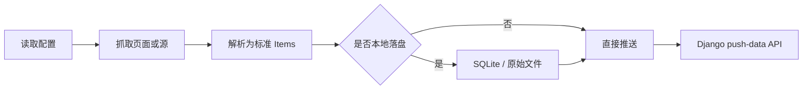

# crawler_agent 技术总结

## 职责定位

`crawler_agent/` 是独立于 Django 主应用的采集客户端，负责抓取外部站点、解析正文、可选落盘，再通过 API 推送到平台。

## 关键能力

| 组件 | 作用 |
| --- | --- |
| `cli.py` / `__main__.py` | 命令行入口，支持 `validate`、`crawl`、`run`、`daemon`、`replay` |
| `config.py` | 配置读取与校验 |
| `http_fetcher.py` / `browser_fetcher.py` | 普通 HTTP 抓取与 Playwright 浏览器抓取 |
| `pusher.py` | 调用后端 `push-data` 接口上报 |
| `items.py` | 采集项数据结构 |
| `logging_utils.py` | 日志封装 |
| `config*.json` | 不同抓取模式示例配置 |

## 工作流

## 技术要点

- 支持 RSS、单页、Sitemap、HTML 列表页和 JS 动态站点。
- `single_page` 默认包含正文抽取去噪逻辑，减少导航与广告内容污染。
- 启用本地 SQLite 后，支持基于 `content_hash` 的增量推送与失败重放。
- 可以从后端接口下载配置，形成“中心配置 + 边缘执行”的采集模式。
- `daemon` 模式支持间隔调度和 Cron 调度，适合持续采集。
